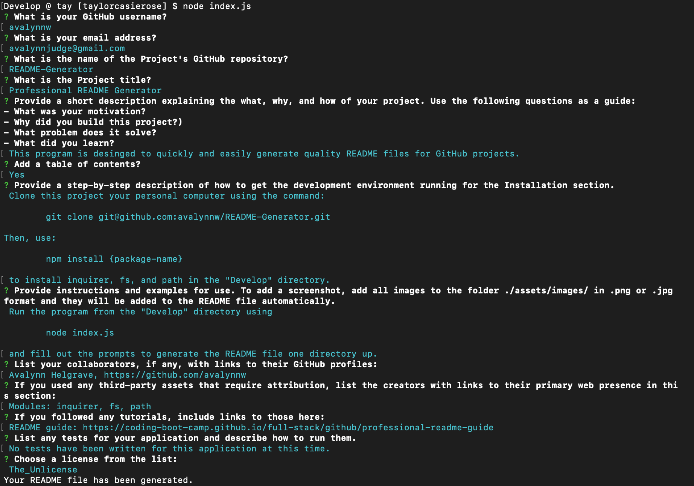

# Professional README Generator

## Description

This program is desinged to quickly and easily generate quality README files for GitHub projects.

## Table of Contents

- [Installation](#installation)
- [Usage](#usage)
- [Contributing](#contributing)
- [License](#license)
- [Tests](#tests)
- [Questions](#questions)

## Installation

Clone this project your personal computer using the command: 

	git clone git@github.com:avalynnw/README-Generator.git 

Then, use: 

	npm install {package-name}

 to install inquirer, fs, and path in the "Develop" directory.

## Usage

Run the program from the "Develop" directory using 

	node index.js

 and fill out the prompts to generate the README file one directory up.

## Contributing

Collaborators: Avalynn Helgrave, https://github.com/avalynnw

Third-Party Assets: Modules: inquirer, fs, path

Tutorials: README guide: https://coding-boot-camp.github.io/full-stack/github/professional-readme-guide

## License

#### The Unlicense

http://unlicense.org/

## Tests

No tests have been written for this application at this time.

## Questions

https://github.com/avalynnw

 Contact me at: avalynnjudge@gmail.com